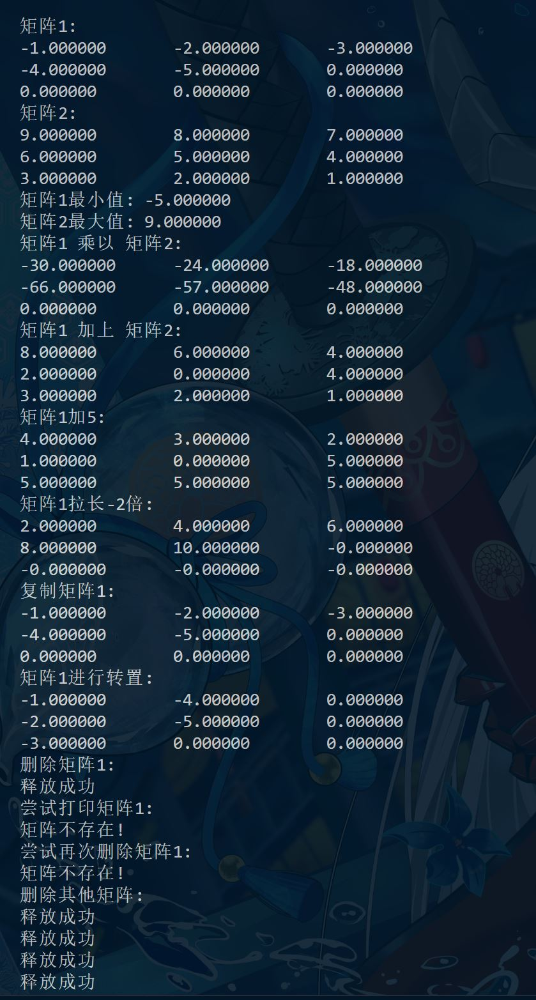

# CS205 C/ C++ Programming - Project 2 Project 3: A Libray for Matrix Operations in C  
**Name:** Lv Yue  
**SID:** 11710420

***This project is hosted at https://github.com/JustLittleFive/SimpleMatrixOperationLibrary***  
## Part1: Analysis  
**Project goal**: Implement a struct for matrices, and the struct contains the data of the matrix, the number of columns, the number of rows, etc.   
  
Only float elements in a matrix are supported.  

## Part2: Core code
The ```header.h``` include all required *C standard library header files*, declare the struct ```Matrix```, and declare functions to manipulate the struct. 

-----
The ```source1.c``` define the struct ```Matrix```, then
implement the functions declared in ```header.h```, which including  
1. ```matrix creation```,  
2. ```matrix deletion```,  
3. ```matrix copy```,  
4. ```matrix assign```,  
5. ```matrix printing```,  
6. ```matrix element access```,  
7. ```matrice addition, subtraction and multiplication```,  
8. ```matrix addition, subtraction and multiplication with scalar```,  
9. ```matrix maximum and minimum elements```  

and  

10. ```matrix transpose```  

functions. All functions can correctly recognize null pointer.

> ***Q***: Why not define the struct in the header file?  
> ***A***: To hide elements inside the structure from the user.  In this way, users who want to access elements in the structure must use the methods provided by the library, and the elements cannot be changed individually.  

-----
The **source2.c** provides a simple demo to use some of the implemented functions.  

  
<br>  

## Part 3: Result & Verification
See picture above. The function behaves as expected. 

## Part 4 - Difficulties & Solutions
1. C language does not have the ```private``` keyword to implement member privatization.  
Solution: The ```Matrix``` structure is **incompletely** declared in the ```header``` file, and implemented in the ```.c``` file.  
2. Struct pointer degenerates to local variable when trying to delete a matrix.  
Solution: Use secondary pointers ```**```. When calling the delete function, pass in the address ```&``` of the matrix pointer.
3. When initializing a matrix, the data area's value cannot be set to float via ```memset```.  
Solution: The matrix initialization is divided into two steps: initialize the structure ```createMatrix``` -> set the value of the matrix ```setMatrix```.